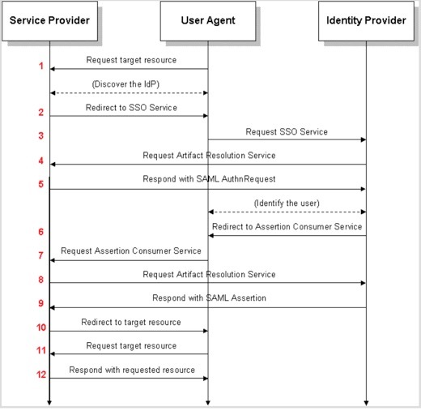
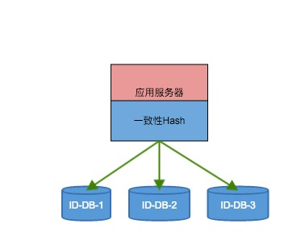

##SAML简介##

----------
>SAML为SSO提供了一个安全的协议。SAML（读作"sam-ell"）是允许Web站点安全地共享身份信息的一个规范，它来自ebxml和其他XML标准背后的国际性联盟OASIS。站点使用SAML的XML词汇表和请求/应答模式，通过HTTP交换身份信息。这种信息共享标准化能帮助Web站点与多个合作伙伴集成，避免由于为不同合作伙伴设计和维护各自私有的集成通道而引起的争论


##项目简介##

----------
SSO-OpenSAML项目既可以作为应用服务器，也可以作为SSO服务器，做为SSO服务器遵循SAML协议，该项目用ARTIFACT-BIND方式实现。


##SSO服务##

----------
###流程简介###


1.*用户访问SP的受保护资源*

2.*SP检查是否有用户的Session，如果用则直接访问*

3.*如果没有Session上下文SP随机生成Artifact，并生成AuthnRequest 如果在Cookie中发现票据信息，把票据信息放到AuthnRequest当中*

4.*SP建立Artifact与AuthnRequest的关联信息*

5.*SP重定向到IDP的接受Artifact接口，用Get方式发送Artifact，和SP在IDP中的注册ID*

6.*IDP接受Artifact，然后用HTTP POST方式来请求SP的getAuthnRequest接口(参数为Artifact)*

7.*SP 接受到IDP传过来的Artifact ，根据Artifact 把关联的AuthnRequest返回给IDP*

8.*IDP接受到getAuthnRequest然后来验证AuthnRequest的有效性，检查 Status Version 等信息，如果Cookie中的票据不为空，则检查票据是否正确，是否在有效期内，如果票据为空，则重定向用户到登录页面来提交信息。*

9.*如果票据正确或者用户通过输入用户名密码等信息通过验证，则IDP生成Artifact对象，IDP生成Response对象，并根据用户信息生成断言，同时对Response 中的 断言做签名处理，对票据对象做加密和签名处理，并把票据信息写入Cookie，并建立Artifact与Response的关联关系，并重定向浏览器到SP的*

*getArtifact接口.*

10 *SP 接受到Artifact，并通过HTTP POST的方式把Artifact发送到IDP*

11 *IDP通过Artifact找到关联的Response对象返回给SP*

12.*SP接受到IDP传输过来的Response对象，首先对Response中的断言做验签操作，如果通过，则同意用户访问资源。*

流程图如下：


>



###OpenSAML2 接口

全部接口定义：

```
	SSO-OpenSAML/src/main/java/org/sms/SysConstants.java

```

验证及生成接口：

```
	SSO-OpenSAML/src/main/java/org/sms/opensaml/service/impl/SamlServiceImpl.java

```

公钥证书配置位置：

```
	SSO-OpenSAML/src/main/resources/opensaml/SPSSODescriptor.xml

```

私钥证书配置位置

```
	SSO-OpenSAML/src/main/resources/opensaml/IDPSSODescriptor.xml
	
```

⚠️如果要使用的话一定要生成自己的证书，我的证书是通过openssl生成的。切记

##做为应用服务器简介
***

###ID生成方式


ID生成流程图如下：

  

1.*服务器启动加载DataSource*

2.*每个Source为一个Node*

3.*虚拟节点可以调整（默认为10个）*

4.*可以根据表名来获取当前表的最大ID值*

5.*利用mysql的ID自增特性，使用replace into来获取自增ID的最新值。*

###配置ID生成器集群

⚠️ ID生成服务器可以有多台数据库服务器组成，假如有1台服务器，那么久不需要设置增长的步长了，假如有N台服务器的话需要设置服务器自增ID的时候的步长是N。MYSQL 中 AUTO_INCRMENT_OFFSET 和
AUTO_INCREMENT_INCREMENT 这两个参数变量,就是用来控制 AUTO_INCREMENT 列的列的起点值和插入新纪录时的增量值。


这样ID就不回重复，而且一致性hash也能实现高可用，即使一台ID集群服务器宕机也能马上找到下个节点来获取ID，而且不会重复。

